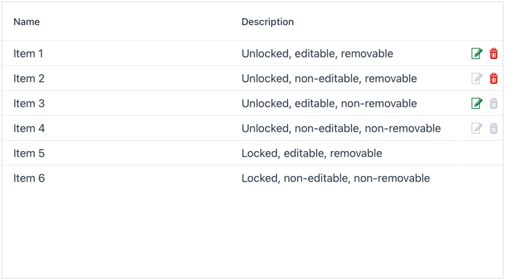

# Vaadin Flow ActionGrid Add-On

The `ActionGrid` add-on extends the Vaadin `Grid` component to facilitate adding row actions. It achieves this via a dedicated "actions" column to hold an icon button for each action. Each action's icon, styling, visibility, enabling, tool-tip, accessible name (ARIA label), and click handler is configurable by row. Actions are added to the grid via a fluent API similar to how columns are added. The "actions" column can be frozen to either the beginning or end of the grid. Mouse clicks in the "actions" column are blocked from being propagated to the grid row to prevent unintended row selection events.


_Source for this screenshot can be found below in the [*Example*](#example) section._

## Features

- **Dedicated Action Column**: A column, which can be hidden or frozen to the beginning or end of the grid, for holding icon-based action buttons.
- **Customizable Actions**: Each action can be tailored with dynamic properties including:
    - Icon
    - CSS styling
    - Accessible name (ARIA-label)
    - Tooltip
    - Visibility
    - Enabling
    - Click event handling
- **Fluent API**: Actions are configured using a chainable API for ease of use.
- **Dynamic Rendering**: The action column automatically refreshes when row items or action properties are updated.
- **Column Management**: Ensures proper handling of the action column in column ordering and visibility.

## Usage

### Creating an ActionGrid

To create an `ActionGrid`, instantiate it as you would a standard Vaadin `Grid`. The action column is automatically added and frozen to the end by default.

```java
ActionGrid<Item> actionGrid = new ActionGrid<>();
```

### Configuring the Action Column

- **Visibility**: Show or hide the action column.
  ```java
  actionGrid.setActionColumnVisible(false);
  ```

- **Header**: Set a header component or text for the action column.
  ```java
  actionGrid.setActionColumnHeader("Actions");
  // or
  actionGrid.setActionColumnHeader(new Span("Actions"));
  ```

- **Freezing**: Freeze the action column to the beginning or end.
  ```java
  actionGrid.setActionColumnPosition(FrozenColumnPosition.BEGINNING);
  // or
  actionGrid.freezeActionColumnToBeginning();
  // or
  actionGrid.setActionColumnPosition(FrozenColumnPosition.END);
  // or
  actionGrid.freezeActionColumnToEnd();
  ```

### Adding Actions

Actions are added to the grid using a unique key. Each action can be configured with either static values or providers to customize its behavior per row item.

```java
    actionGrid.addAction("edit")
        .setIcon(VaadinIcon.EDIT.create())
        .setClassName(item -> item.isEditable() ? LumoUtility.TextColor.SUCCESS : null)
        .setAccessibleName(item -> "Edit " + item.getName())
        .setTooltip("Edit this item")
        .setVisible(Item::isUnlocked)
        .setEnabled(Item::isEditable)
        .addClickHandler(item -> Notification.show("Editing: " + item.getName(), 5000, MIDDLE));
```

### Retrieving Actions

You can retrieve the list of actions or a specific action by its key.

```java
List<Action> actions = actionGrid.getActions();
Action editAction = actionGrid.getActionByKey("edit");
```

### Removing Actions

Actions can be removed individually or all at once.

```java
actionGrid.removeAction(editAction);
actionGrid.removeActionByKey("edit");
actionGrid.removeAllActions();
```

### Managing Columns

The `ActionGrid` overrides column management methods to ensure the action column is properly positioned. When adding columns or setting column order, the appropriate position of the action column is automatically handled.

## Notes

- The action column cannot be directly accessed—it is not returned by any of the `getColumnXXX()` methods—so that all of its manipulation can be controlled through its API.
- The `ActionGrid` ensures the action column is properly ordered where frozen using internal sorting logic.
- All action properties are refreshed automatically when modified, ensuring the UI stays in sync.
- The component uses `LitRenderer` for rendering action buttons, leveraging Vaadin's button and icon components.
- Server side logic prevents client-side HTML manipulation from accepting hidden or disabled button clicks.
- An `ActionGridTester` and `ActionGridElement` are available for unit and integration testing, respectively.

## Example

Below is a complete example of using `ActionGrid` with a simple data model.

```java
@Route(value = "action-grid")
public class ActionGridView extends Composite<VerticalLayout> {

  public ActionGridView() {
    ActionGrid<Item> actionGrid = new ActionGrid<>();
    actionGrid.setColumnReorderingAllowed(true);

    actionGrid.addColumn(Item::getName)
            .setHeader("Name");
    actionGrid.addColumn(Item::getDescription)
            .setHeader("Description");

    actionGrid.addAction("edit")
            .setIcon(VaadinIcon.EDIT.create())
            .setClassName(item -> item.isEditable() ? LumoUtility.TextColor.SUCCESS : null)
            .setAccessibleName(item -> "Edit " + item.getName())
            .setTooltip("Edit this item")
            .setVisible(Item::isUnlocked)
            .setEnabled(Item::isEditable)
            .addClickHandler(item -> Notification.show("Editing: " + item.getName(), 5000, MIDDLE));
    actionGrid.addAction("delete")
            .setIcon(item -> VaadinIcon.TRASH.create())
            .setClassName(item -> item.isRemovable() ? LumoUtility.TextColor.ERROR : null)
            .setAccessibleName(item -> "Delete " + item.getName())
            .setTooltip(item -> "Delete this item")
            .setVisible(Item::isUnlocked)
            .setEnabled(Item::isRemovable)
            .addClickHandler(item -> Notification.show("Deleting: " + item.getName(), 5000, MIDDLE));

    actionGrid.setItems(
            new Item("Item 1", "Unlocked, editable, removable", true, true, true),
            new Item("Item 2", "Unlocked, non-editable, removable", true, false, true),
            new Item("Item 3", "Unlocked, editable, non-removable", true, true, false),
            new Item("Item 4", "Unlocked, non-editable, non-removable", true, false, false),
            new Item("Item 5", "Locked, editable, removable", false, true, true),
            new Item("Item 6", "Locked, non-editable, non-removable", false, false, false)
    );

    getContent().add(actionGrid);
  }

  private static class Item {
    private String name;
    private String description;
    private boolean unlocked;
    private boolean editable;
    private boolean removable;

    public Item(String name, String description, boolean unlocked, boolean editable, boolean removable) {
      this.name = name;
      this.description = description;
      this.unlocked = unlocked;
      this.editable = editable;
      this.removable = removable;
    }

    public String getName() {
      return name;
    }

    public String getDescription() {
      return description;
    }

    public boolean isUnlocked() {
      return unlocked;
    }

    public boolean isEditable() {
      return editable;
    }

    public boolean isRemovable() {
      return removable;
    }
  }
}
```

## Partial API Documentation

### ActionGrid Methods

- `addAction(String key)`: Adds a new action with the specified key.
- `getActions()`: Returns an unmodifiable list of actions.
- `getActionByKey(String key)`: Retrieves an action by its key.
- `removeAction(Action action)`: Removes a specific action.
- `removeActionByKey(String key)`: Removes an action by its key.
- `removeAllActions()`: Removes all actions.
- `setActionColumnVisible(boolean visible)`: Sets the visibility of the action column.
- `setActionColumnHeader(Component headerComponent)`: Sets the header component for the action column.
- `setActionColumnHeader(String headerText)`: Sets the header text for the action column.
- `setActionColumnPosition(FrozenColumnPosition)`: Freezes the action column to the provided position.
- `freezeActionColumnToBeginning()`: Freezes the action column to the beginning.
- `freezeActionColumnToEnd()`: Freezes the action column to the end.

### Action Methods

- `setIcon(SerializableFunction<T, Icon>)`: Sets the provider for the action's icon.
- `setIcon(Icon)`: Sets the action's icon.
- `setClassName(SerializableFunction<T, String>)`: Sets the provider for the action's CSS class.
- `setClassName(String)`: Sets the action's CSS class.
- `setAccessibleName(SerializableFunction<T, String>)`: Sets the provider for the action's aria-label.
- `setAccessibleName(String)`: Sets the action's aria-label.
- `setTooltip(SerializableFunction<T, String>)`: Sets the provider for the action's tooltip.
- `setTooltip(String)`: Sets the action's tooltip.
- `setVisible(SerializablePredicate<T>)`: Sets the predicate for the action's visibility.
- `setVisible(boolean)`: Sets the action's visibility.
- `setEnabled(SerializablePredicate<T>)`: Sets the predicate for the action's enablement.
- `setEnabled(boolean)`: Sets the action's enablement.
- `addClickHandler(SerializableConsumer<T>)`: Sets the consumer for the action's click handler.

## Installation

The `ActionGrid` component is part of the `org.vaadin.addons.joelpop.ui.component` package. Ensure you have the necessary dependencies for Vaadin Flow in your project. Add the addon to your project using your build tool (e.g., Maven or Gradle).

For Maven, include the dependency in your `pom.xml`:

```xml
<dependency>
    <groupId>org.vaadin.addons.joelpop</groupId>
    <artifactId>action-grid</artifactId>
    <version>1.0.0</version>
</dependency>
```

## License

This component is licensed under the Apache License 2.0.

## (Note to Maintainer — Publishing to Vaadin Directory)

Create the zip package needed for [Vaadin Directory](https://vaadin.com/directory/) using

```
mvn versions:set -DnewVersion=1.0.0 # You cannot publish snapshot versions 
mvn clean package -Pdirectory
```

The package is created as `target/{project-name}-1.0.0.zip`

For more information or to upload the package, visit https://vaadin.com/directory/my-components?uploadNewComponent
